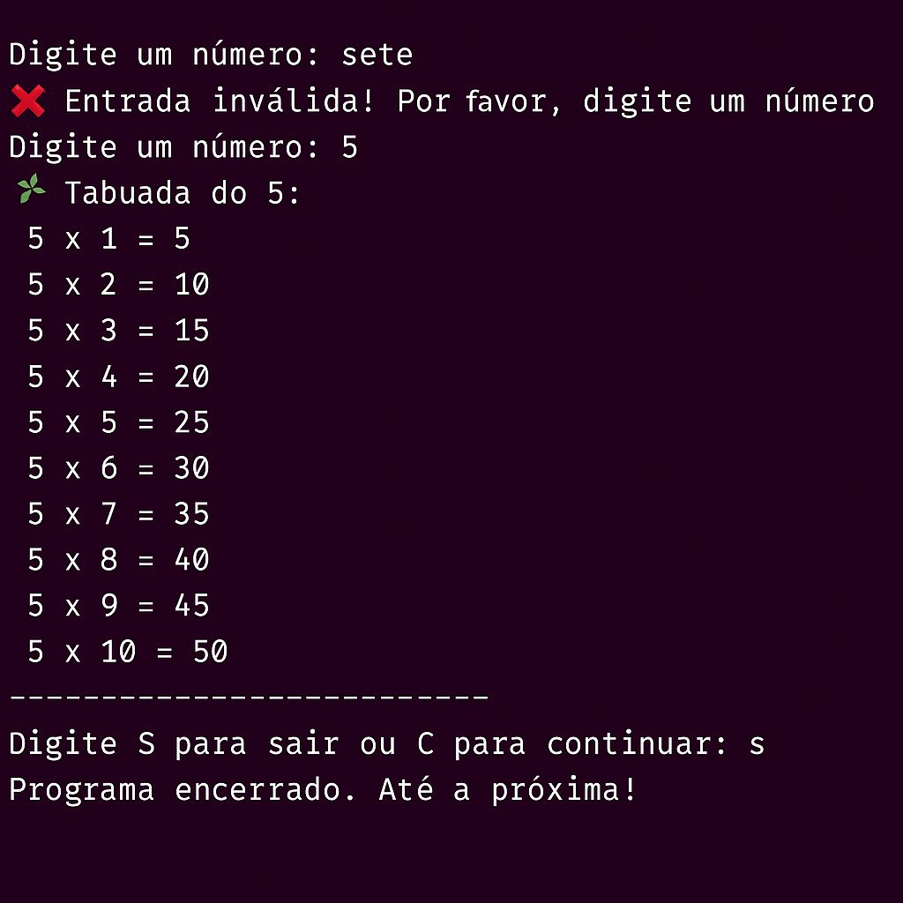

# 🧮 Gerador de Tabuada em Python

Este projeto foi desenvolvido como prática de lógica de programação em Python. O programa solicita ao usuário um número, exibe sua tabuada de 1 a 10 e permite repetir o processo ou encerrar, de forma interativa e segura.

---

## 💡 Funcionalidades

- Entrada de número com tratamento de erro (`try/except`)
- Geração da tabuada de 1 a 10 usando laço `for`
- Loop de repetição com opção de **sair ou continuar**
- Feedback amigável no terminal

---

## 🛠 Tecnologias utilizadas

- Python 3
- Terminal (linha de comando)
- Lógica de Programação
- `try/except`, `while`, `for`, `f-strings`

---

## ✅ Exemplo de execução




---

## 🚀 Como executar o projeto

1. Clone este repositório ou baixe o arquivo `tabuada.py`
2. Execute o script no terminal:

```bash
python tabuada.py
